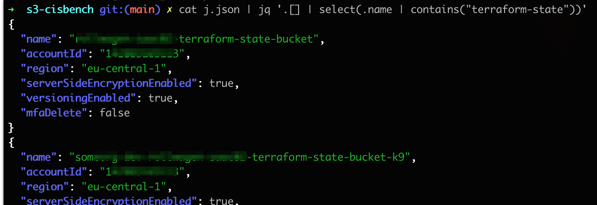

# s3-cisbench

[](https://github.com/rollwagen/s3-cisbench/releases)
[](https://goreportcard.com/report/github.com/rollwagen/s3-cisbench)

[](https://github.com/goreleaser)


A simple command line tool that checks S3 bucket against (security-) best
practices, mainly CIS benchmark based.


## CIS AWS Benchmark v1.4.0: Storage

The AWS Benchmark section 'Storage' contains the S3 bucket related items,
namely:

* 2.1.1 Ensure all S3 buckets employ encryption-at-rest
* 2.1.2 Ensure S3 Bucket Policy is set to deny HTTP requests
* 2.1.3 Ensure MFA Delete is enable on S3 buckets
* 2.1.4 Ensure all data in Amazon S3 has been discovered (_out of scope_)
* 2.1.5 Ensure that S3 Buckets are configured with 'Block public access'
  * ✖ ✔ BlockPublicAcls (BPA)
  * ✖ ✔ BlockPublicPolicy (BPP)
  * ✖ ✔ IgnorePublicAcls (IPA)
  * ✖ ✔ RestrictPublicBuckets (RPB)

Currently known limitations:

* encryption at rest only checks for default AES256 algorithm and reports false otherwise


## Usage

```text
$ s3-cisbench --help
s3-csibench is a tool that analyses S3 bucket against CIS benchmark rules.

Usage:
  s3-cisbench [flags]
  s3-cisbench [command]

Available Commands:
  audit       Audit S3 buckets against applicable CIS benchmark items
  completion  Generate the autocompletion script for the specified shell
  help        Help about any command
  list        List AWS S3 buckets.

Flags:
  -d, --debug   Enable verbose logging
  -h, --help    help for s3-cisbench

Use "s3-cisbench [command] --help" for more information about a command.
```

The `audit` command supports dynamic completion of available buckets.


> Screenshots below show and early version that didn't yet have all benchmark checks

### 'audit' Command Output Example


### 'audit -o json' Command Example with 'jq' processing

Usage of json output with leveraging `jq` for further filtering:




## Install and run

### Brew

```sh
brew tap rollwagen/homebrew-tap
brew install rollwagen/tap/s3-cisbench
```

### Go

To run directly:

```sh
go run github.com/rollwagen/s3-cisbench@latest --help
```

## Build

```sh
git clone https://github.com/rollwagen/s3-cisbench
cd s3-cisbench
make
```
